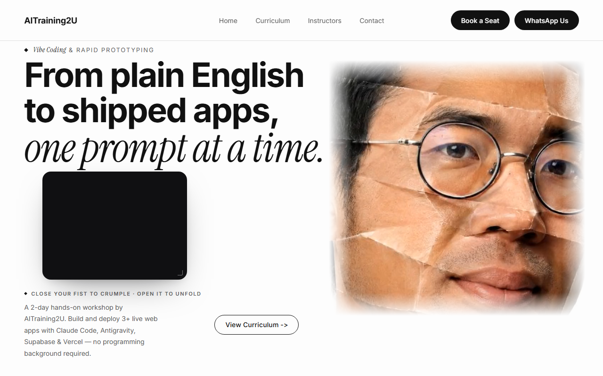

# Kinetic Fold — AITraining2U

Landing page for **AITraining2U**'s AI Vibe Coding + Rapid Prototyping workshop — with a hero where a paper-crumple portrait video is scrubbed in real time by your hand.

Open your hand and the crumpled paper ball unfolds into a portrait. Close it into a fist (or pinch) and the portrait crumples back up. No buttons — the video timeline **is** your hand.

**[Live demo →](https://lowjinghong29.github.io/Kinetic-Fold/site/)** *(needs a webcam; allow camera access)*



## How it works

- **Hand tracking** — [MediaPipe Tasks Vision](https://ai.google.dev/edge/mediapipe/solutions/vision/hand_landmarker) `HandLandmarker` runs on the webcam feed and returns 21 3D landmarks per frame
- **Gesture → progress** — `handCloseProgress` (0 = open, 1 = fist/pinch) is computed from metric *world landmarks*: average fingertip-to-wrist distance normalized by palm size, combined with thumb–index pinch distance. World coordinates keep it robust to hand orientation
- **Progress → timeline** — the smoothed progress is mapped straight onto `video.currentTime`, so the fold animation tracks your hand with no playback of its own. No hand detected = the frame freezes
- **Seekable anywhere** — the video is fetched as a Blob (object URLs are always fully seekable, even on static servers without HTTP Range support) and re-encoded all-intra (`-g 1`) so every frame is a keyframe and scrubbing never stutters
- **Page follows the video** — the footage's backdrop fades from white to black over its 10 seconds. A per-frame luminance table (measured offline from the original footage) maps `video.currentTime` to CSS custom properties, so the entire site background, text ink, and hairlines darken and invert in exact sync with the video. A radial feather mask blends the square video into the matching page color
- **Camera PiP** — a clean, draggable, resizable mirror window with a live hand-skeleton overlay

## The workshop

A 2-day hands-on vibe coding workshop: build and deploy 3+ live web apps with Claude Code, Google Antigravity, Supabase & Vercel — no programming background required. 100% HRDC claimable (SBL-KHAS).

- 15–16 August 2026 · WORQ Subang, Kuala Lumpur
- [Book a seat](https://forms.gle/DvghVTjt9F6P8uko9) · [WhatsApp](https://wa.me/60126791203) · hi@aitraining2u.com

## Run locally

Camera access requires a secure context (HTTPS or localhost):

```bash
cd site
python -m http.server 8931
# open http://localhost:8931
```

## Stack

Vanilla HTML/CSS/JS · MediaPipe Tasks Vision (CDN) · no build step

## Structure

```
├── index.html               # root redirect to site/
├── preview.png              # README preview image
├── assets/
│   └── source-footage.mp4   # raw footage fold.mp4 is produced from
└── site/
    ├── index.html           # hero + curriculum, instructors, details sections
    ├── style.css            # theme (driven by app.js), camera PiP, marquee
    ├── app.js               # hand tracking, gesture math, timeline + theme driver
    └── fold.mp4             # paper-crumple video (720x720, 10s, all-intra)
```
